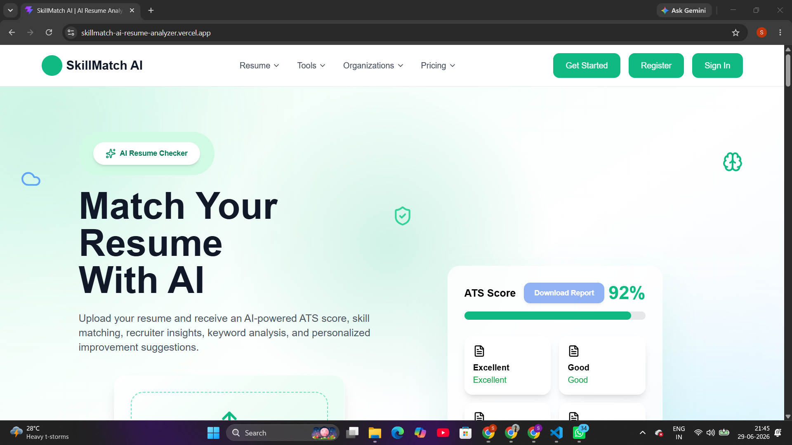
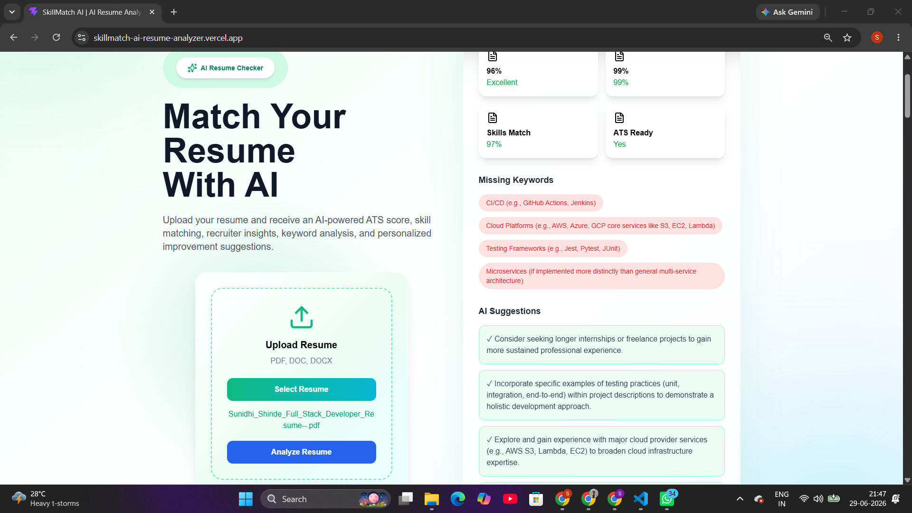
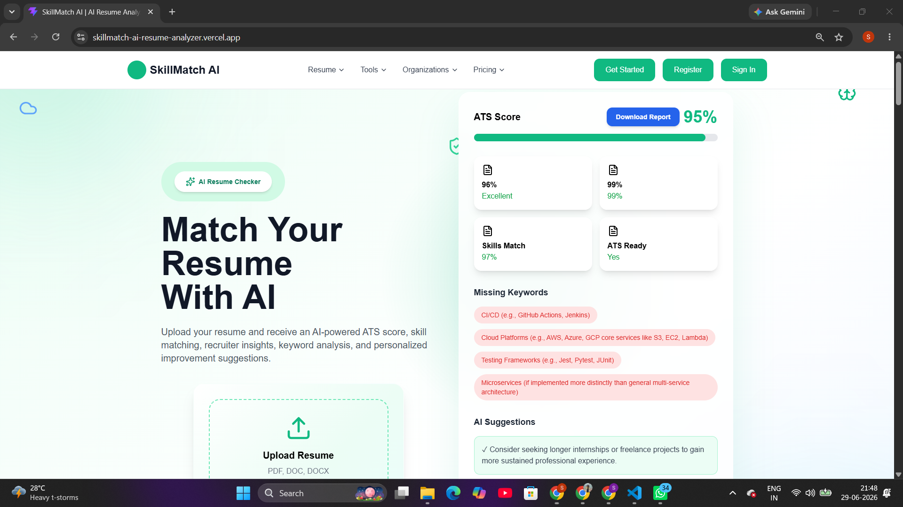
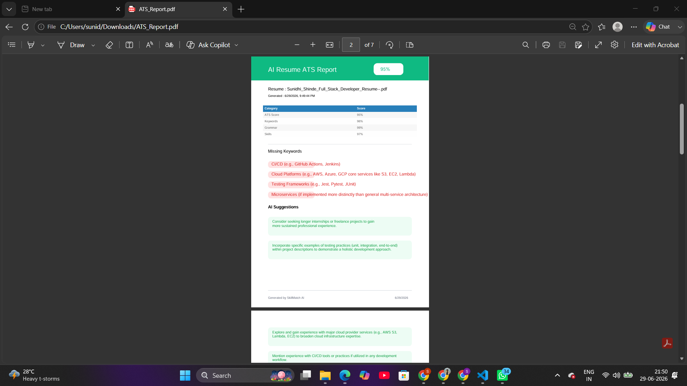

# 🚀 SkillMatch AI – AI Resume Analyzer

An AI-powered Resume Analyzer that evaluates resumes using ATS (Applicant Tracking System) standards and provides intelligent feedback with the help of **Google Gemini AI**.

---

## 🌐 Live Demo

**Live Website:**
https://your-vercel-link.vercel.app

---

## ✨ Features

* 🤖 AI Resume Analysis using Gemini AI
* 📊 ATS Score Calculation
* 🎯 Resume & Skill Match Analysis
* 🔍 Missing Keywords Detection
* 💡 AI-Powered Improvement Suggestions
* 👨‍💼 Recruiter Insights
* 📄 Download ATS Report as PDF
* 📱 Fully Responsive Design
* ⚡ Fast & Modern User Interface
* ☁️ Cloud Deployment (Vercel + Render)

---

## 🛠 Tech Stack

### Frontend

* React.js
* Vite
* Tailwind CSS
* Framer Motion
* Axios

### Backend

* Node.js
* Express.js
* Multer
* PDF.js
* Google Gemini AI API

### Deployment

* Vercel
* Render

---

## 📂 Project Structure

```text
frontend/
backend/
screenshots/
README.md
```

---

## ⚙️ Installation

Clone the repository

```bash
git clone https://github.com/your-username/skillmatch-ai-resume-analyzer.git
```

Install dependencies

```bash
npm install
```

Run Frontend

```bash
npm run dev
```

Run Backend

```bash
npm start
```

---

## 🔑 Environment Variables

Backend

```env
GEMINI_API_KEY=YOUR_API_KEY
FRONTEND_URL=http://localhost:5173
```

Frontend

```env
VITE_API_URL=http://localhost:5000/api
```

---

## 📸 Screenshots

### Home Page



### Resume Upload



### ATS Report



### Downloaded PDF



---

## 🎯 Future Enhancements

* Job Description Match
* Resume Builder
* Cover Letter Generator
* Authentication
* User Dashboard
* Resume History

---

## 👩‍💻 Author

**Sunidhi Shinde**

LinkedIn: https://www.linkedin.com/in/sunidhishinde/

GitHub: https://github.com/soniyaritgithub

---

⭐ If you like this project, please give it a Star.
